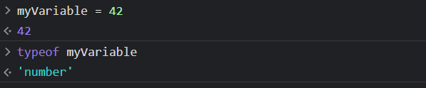

# JavaScript
We can directly write javascript into the **browser's console** or any IDE like **vs code**.

# JavaScript Comments and Data Types:
## JavaScript Comments:
- they are simply **notes**

- starts with *//* and then add any note or description in front-of it.

- used comments to leave a notes for ourselves or for other developers
- Example: //this is a comment -> undefined

## JavaScript Data Types:
There are 4 basic data types that you work with in JavaScript, all the time.
### String:
- need to enclose into data into quotes **""**
- we can use double quotes **""** or sigle quotes **''** for data.  Example: "Zeeshan", 'Ahmed'
- use function **typeof(value)** to let know the **data type** of **passed value**. Example: typeof("Zeeshan") or typeof 'Zeeshan' -> String

### Number:
- represent numerical data like 32, 4, etc.
- Example: typeof 42 -> Number

### Boolean:
- represent boolean data like true/false value.
- Example: typeof true, typeof false -> Boolean

### Undefined:
- represents absense of value

## Variables:
### Declaring a Variable:
- they are defined by using **var, let, const** keywords + variableName. 
- Use cameCase means first word is in small caps and other word's first letter will be in capital letters.
- Example: let myVariable;

### Initializing a Variable:
- use **=** and then **value** to be assigned to a variable.
- Example: let myVariable = "Zeeshan" and can - - - check type of variable by **typeof myVariable** //string

### Re-initializing/Re-assigning a Variable:
- use **variableName = newValue** where *newValue* is any type of value
- Example: myVariable = 42, typeof(myVariable) //Number

## Mathematical Operators:

- *+* operator concatenates data when with string data type but if used with numerical data type, + operator will perform mathematical operations like addition.

## Boolean Data type:

## Review:

## Hello World Program:
