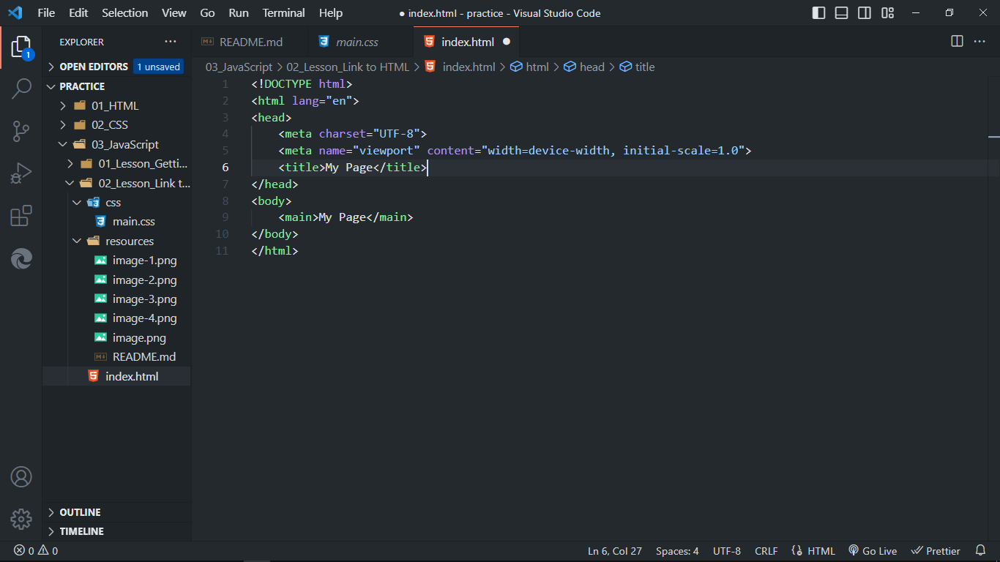

# Link to HTML:
Where do I put JavaScript and how do I link JavaScript to HTML?

## Setting Up Dev (Development) Environment:
- download vscode from Internet according to your OS.

- after downloading, install vscode (accept default settings) and then open it.

- create a directory in window and then open in vscode like "js"

- create html document or file. **index.html**. Use **! + Enter** to create html template file by vscode

 
- create css file by creating **css** folder, **main.css** inside of it, write css code and then save file.

- write js code inside **** tags and then write *console("Hello World");* to the chrome dev tools console

- open **chrome** browser, type **about:blank** address to address bar to open blank page, open chrome dev tools **Ctrl+Shift+I -> console** and there you see the output.

- click on the address, press **ctrl+o**, then **select the index.html** file to open and then you see **Hello World!** on the console.
 

- to add JavaScript externally to in a separate file, create folder js->main.js and then write *console.log("Hello World");*, save file, open index.html file, remove script tag and then link file using ** where path = 'js/filename.js', save html file and refresh browser.
