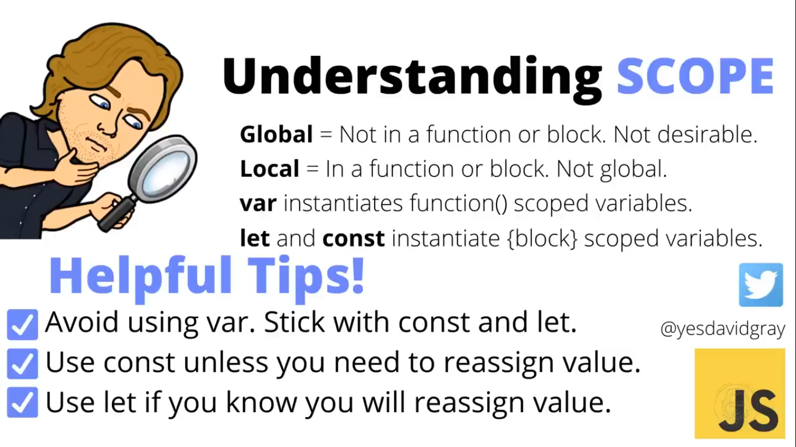

# Scope: 

- Today, we will discuss about **var, let and const**. They are used to declare variables in JavaScript.

- All of these three keywords will let to the discussion of scope.

- 

## var (Function Scoped):
- use when you knwo you will re-declare a variable in the same block of code, re-assign value to same variable inside and show as a legacy code

## let (Block Scoped):
- use when you know that you will re-assign a different value to the variable declared once and use anywhere any number of times in the code but you will only declare once inside block of code like inside program, conditional statements,

## const (Block Scoped):
- use when you know that you only need to assign value once and use any where any number of times.

## Scope of var, let, const

### Global Scope:
- variables declared in the global scope will be accessible any where in the program

- where you can use the variable any where in the program and it doesn't matter which type of keyword we use "var, let, const"

- <code>
var x = 1;
let y = 2;
const z = 3;  
</code>

- It is available to all blocks below global, it can go inside functions, it can go other functions that are nested inside other functions, it can go blocks of code (defined by {}, if-else{}, switch{}, for{}, while{} etc.) that are in the function

### Local Scope:
- there can be more than one local scope
- variables declared inside local scope are accessible only to local or inside block or function but not outside of them.

#### Block Level Scope
- we use block {} and inside of it, use keywords "let" to declare variable
- <code> {
    let y = 4;
}
</code>

#### Function Level Scope:
- we can put a block inside of a function
- we can also put another function inside of a function  

