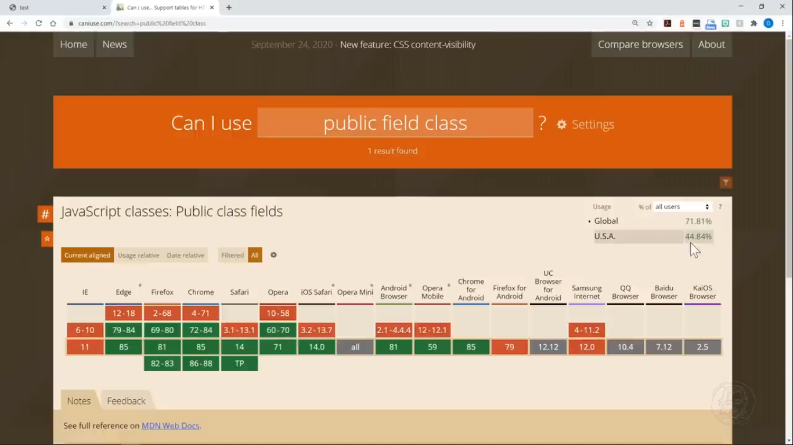
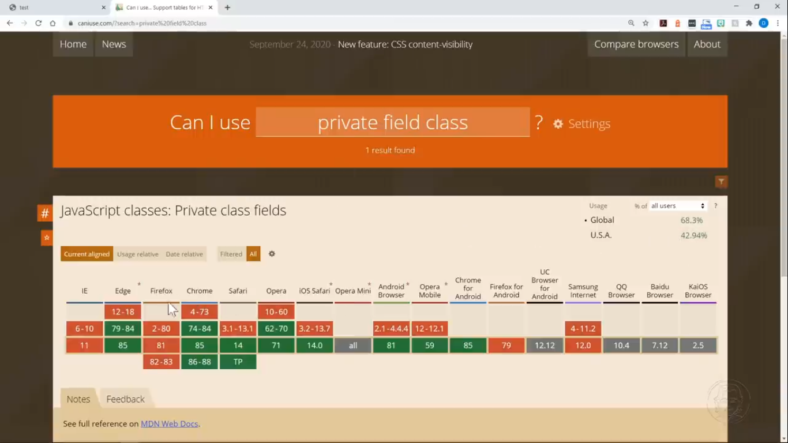

# Classes in JS

- they are blueprint for creating objects

- classes syntax not come untill 2016 in js

- classes are just different way for use to layout features. It is a new syntax but it doesn't change the actual functionality

- for making properties private (to only accessible inside that particular class and use get and set methods to modify values) use _ in front of variable name. Example: this._size = pizzaSize;

## Resource:
- caniuse.com (to check for how much support of new features)

