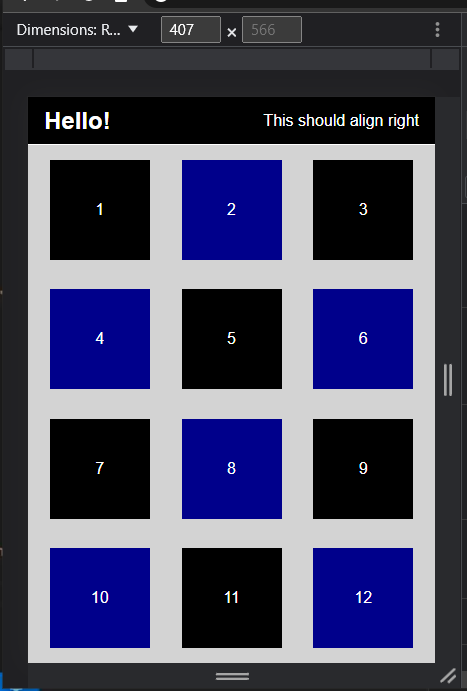
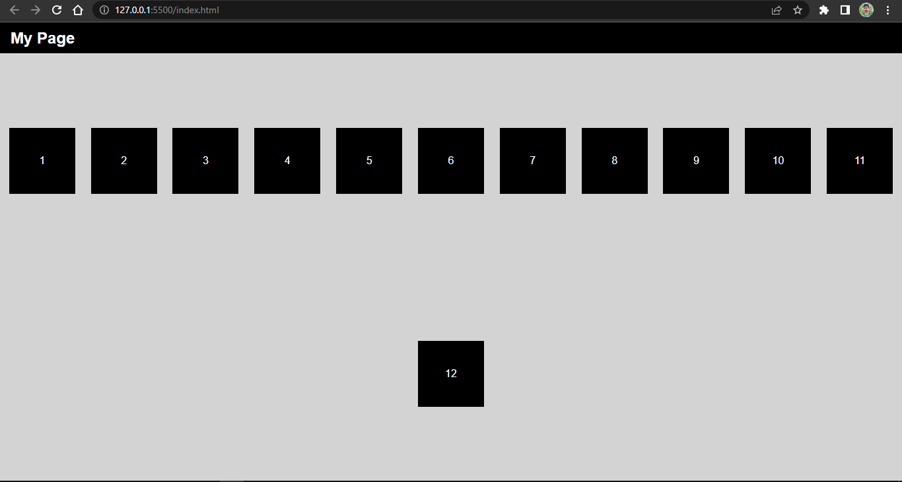

# DOM (Document Object Model)
- DOM provide a single object of whole web page

- Elements of the web page can be manipulated using the DOM Object

- Think DOM as Tree where html is the root and from there other elements like *head, body, etc* and they also have their own children.

- **html collection**: it has elements inside of it

- **node list**: it has nodes (every element is the node)

- In HTML DOM, nodes are everything. Nodes can be whitespace, text inside of an element. So, there are more nodes than the elements in a web page.

- we can select nodes, apply different css styles, manipulate nodes, add or remove nodes and use iterators to add or remove dynamically nodes from the page.

## Selecting Elements:
We can select elements in DOM by using id or class.

### By ID:
<code>
const view1 = document.getElementById('view1');
const view2 = document.querySelector("#view2");
</code>

### By class name: 
const view = document.getElementsByClassName('view');
const sameViews = document.querySelectorAll('.view');
</code>

### with Tag Name:
<code>
const smaDivs = view1.getElementsByTagName("div");
console.log(smaDivs);
</code>

### with Elements and CSS Pseudo Classes
<code>
//select even divs
const evenDivs = view1.querySelectorAll("div:nth-of-type(2n)");
console.log(evenDivs); //NodeList(6)
</code>

## Altering Web Page Content:

### Using CSS style Property
<code>
evenDiv.style.backgroundColor = "darkblue";
evenDiv.style.width = "200px";
evenDiv.style.height = "200px";
</code>

### Changing Content inside Element
<code>
const navText = document.querySelector('nav h1');
navText.textContent = "Hello World!";
console.log(navText);
const navbar = document.querySelector("nav");
navbar.innerHTML = `<h1>Hello!</h1> 
This should align right
`   //insert html with innerHTML
<code>

Note: 
- *textContent* is used to simply add text content but *innerHTML* is used to put html content inside element
;

- *children* are actual elements and *childNodes* are just elements (like text nodes, whitespace nodes, nodes etc.);

OUTPUT:

