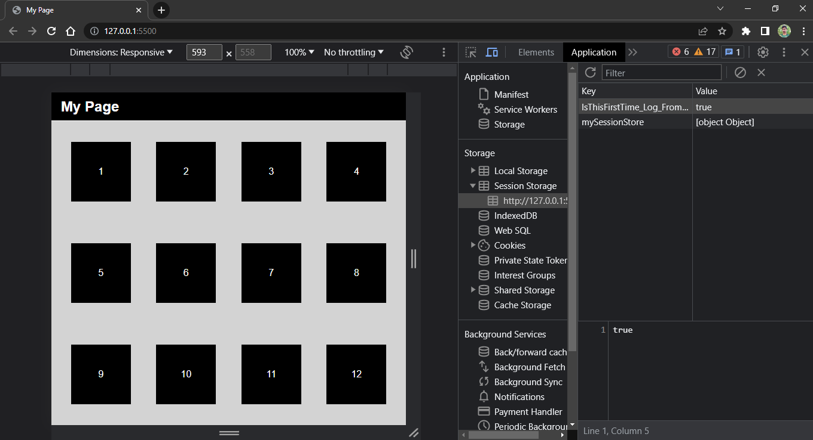
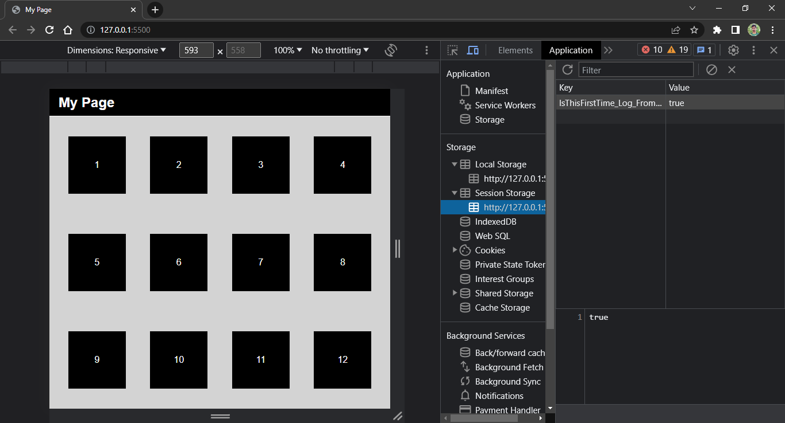
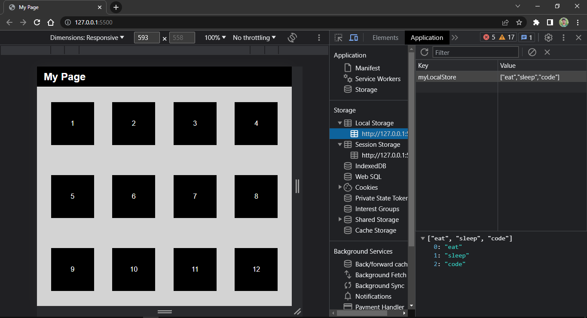
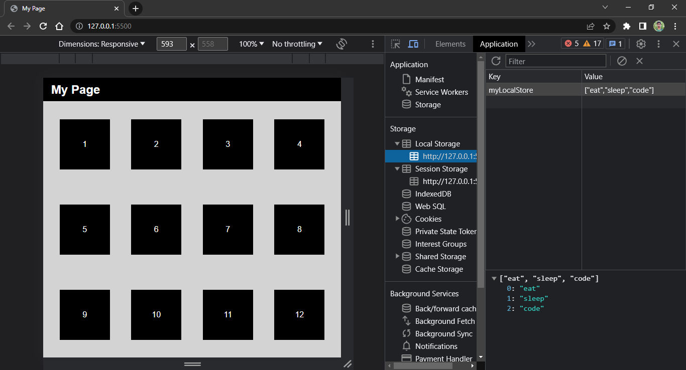

# Web Storage API

- It is not part of the DOM instead it referes to the window API

- It is available to JS via the global variable **window**

- We do not have to type window. It is implied.

- To view storage section in Browser, go to **application tab** in dev tools -> storage -> session storage, local storage

- Local Storage and Session Storage only stores data in string form and  if the data is not string then convert data into string.

- It is much like working with JSON

- Note: when convert object into json, it will not store method 

- When we try to get data from storage and if we get **null** that means data is not present or key is not present to which data we want to retrive.

## Session Storage:
- only keep data in session, and when we close the tab or browser, the data is removed

- after closing and re-opening browser, we lost data stored in session storage

## Local Storage:
- it will store persistent data and will continue to store data in browser but not attached to open tab or open brower. We can go close the tab, then again go the website and retrive the data

- after closing and re-opening browser, the data remain persistent or keep stored in local storage

- Local Storage might be useful for applications like: **Todo List, High Scoring Game etc**
