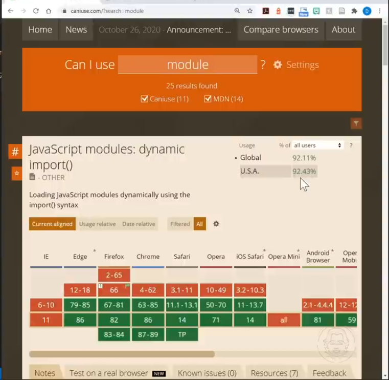

# Modules:

- modules were introduced with ES6 in 2015

- they are used to export different sections of code from one file to another and that exported code can be imported to other file

- these sections are usually fuctions or classes

- check the support of Modules in js
